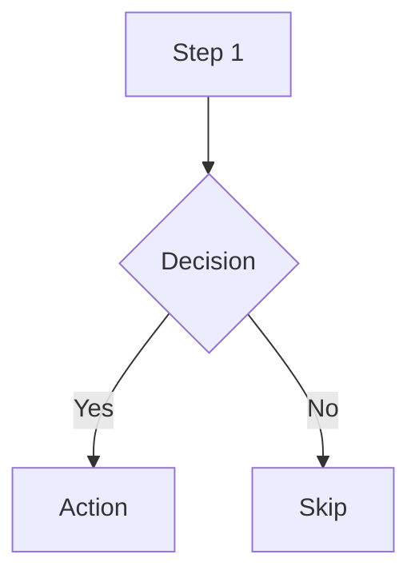

<!-- digest:auto-generated from SKILL.md — do not edit manually -->

# Mermaid Diagrams (Digest)

Compact reference for agent startup. Read full `SKILL.md` for details.

## When to Use Mermaid

- Inline diagrams inside markdown documents (`.md`, `.mdx`)
- Quick flowcharts for operational runbooks and process docs
- Sequence diagrams for auth flows and API interactions
- Gantt charts for project plans and maintenance schedules
- State diagrams for lifecycle documentation
- ER diagrams for data model overviews
- Azure resource relationship diagrams from live queries

## Syntax Reference

### Flowcharts


> _See SKILL.md for full content._

## Theming (Dark Mode Compatible)

Include a neutral theme directive for dark mode compatibility:
> _See SKILL.md for full content._

## Node Styling

Use `classDef` for consistent node styling:
> _See SKILL.md for full content._

## Azure Resource Visualization

For visualizing live Azure resource groups as Mermaid diagrams, use the
`azure-resources` skill (Mode B: Visualize) which outputs resource relationship
diagrams in Mermaid format. That skill handles Azure Resource Graph queries,
resource discovery, and relationship mapping.

### Resource Diagram Conventions

- Group by layer: Network, Compute, Data, Security, Monitoring
> _See SKILL.md for full content._

## Astro / Starlight Integration

In this project, Mermaid is rendered client-side by `rehype-mermaid-lite`.
Use fenced code blocks with `mermaid` language:

````markdown
```mermaid
graph LR
  A --> B
> _See SKILL.md for full content._

## Guardrails

**DO:** Use fenced code blocks with `mermaid` language tag · Include theme
directives for dark mode · Use `graph TB` for vertical layouts · Use subgraphs
for grouping · Use descriptive connection labels · Validate syntax before
committing.

**DON'T:** Use Mermaid for WAF/cost charts (use `python-diagrams`) · Use Mermaid
for primary architecture diagrams with Azure icons (use `drawio`) · Omit
theme directives · Create overly complex diagrams that don't render well ·
> _See SKILL.md for full content._

## Scope Exclusions

Does NOT: generate Draw.io architecture diagrams · produce Python charts ·
generate Bicep/Terraform · create ADRs · deploy resources · embed Azure service
icons (use `drawio` skill).
