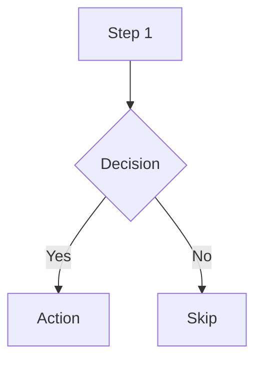
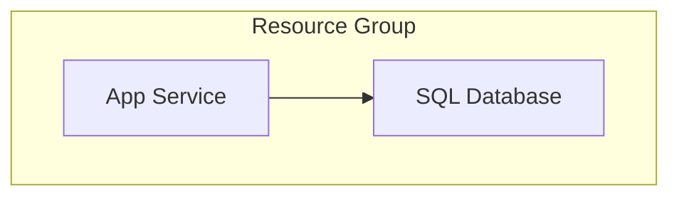
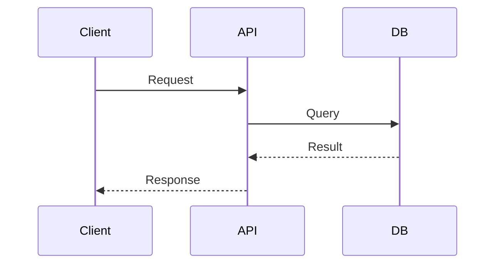
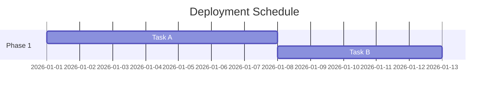
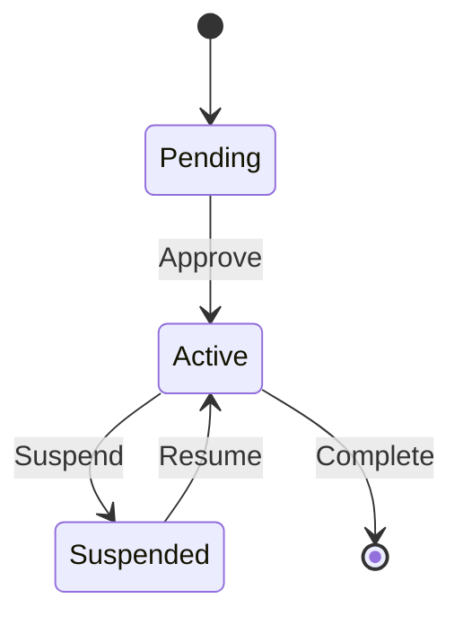
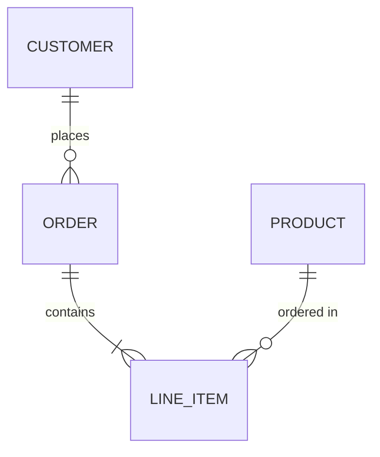
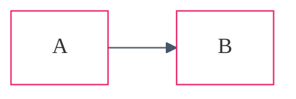
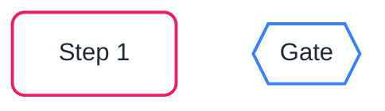

# Mermaid Diagrams

Skill for generating Mermaid diagrams embedded in markdown fences. Mermaid is used
for inline documentation diagrams — flowcharts, sequences, state machines, ER
diagrams, and Gantt charts. For architecture diagrams with Azure service icons,
use the `drawio` skill instead.

## When to Use Mermaid

- Inline diagrams inside markdown documents (`.md`, `.mdx`)
- Quick flowcharts for operational runbooks and process docs
- Sequence diagrams for auth flows and API interactions
- Gantt charts for project plans and maintenance schedules
- State diagrams for lifecycle documentation
- ER diagrams for data model overviews
- Azure resource relationship diagrams from live queries

## Syntax Reference

### Flowcharts



Use `graph TB` (top-to-bottom) for vertical layouts.
Use `graph LR` (left-to-right) for horizontal layouts.
Use subgraphs for logical grouping:



### Sequence Diagrams



### Gantt Charts



### State Diagrams



### ER Diagrams



## Theming (Dark Mode Compatible)

Include a neutral theme directive for dark mode compatibility:



## Node Styling

Use `classDef` for consistent node styling:



## Azure Resource Visualization

For visualizing live Azure resource groups as Mermaid diagrams, use the
`azure-resources` skill (Mode B: Visualize) which outputs resource relationship
diagrams in Mermaid format. That skill handles Azure Resource Graph queries,
resource discovery, and relationship mapping.

### Resource Diagram Conventions

- Group by layer: Network, Compute, Data, Security, Monitoring
- Include resource details in node labels (use `<br/>` for line breaks)
- Label all connections descriptively
- Use subgraphs for logical grouping
- Connection types:
  - `-->` for data flow or dependencies
  - `-.->` for optional/conditional connections
  - `==>` for critical/primary paths

## Astro / Starlight Integration

In this project, Mermaid is rendered client-side by `rehype-mermaid-lite`.
Use fenced code blocks with `mermaid` language:

````markdown

````

## Rules

**DO:** Use fenced code blocks with `mermaid` language tag · Include theme
directives for dark mode · Use `graph TB` for vertical layouts · Use subgraphs
for grouping · Use descriptive connection labels · Validate syntax before
committing.

**DON'T:** Use Mermaid for WAF/cost charts (use `python-diagrams`) · Use Mermaid
for primary architecture diagrams with Azure icons (use `drawio`) · Omit
theme directives · Create overly complex diagrams that don't render well ·
Use inline Mermaid for diagrams that need icon embedding.

## Steps

1. **Pick the diagram type** — flowchart, sequence, Gantt, state, ER, class — see [Syntax Reference](#syntax-reference)
2. **Choose the layout** — `graph TB` (vertical) or `graph LR` (horizontal); use subgraphs for logical grouping
3. **Author the diagram** inside a triple-backtick `mermaid` fence in your markdown
4. **Add theming** — include dark-mode-compatible theme directives (see [Theming](#theming-dark-mode-compatible))
5. **Apply node styling** — use descriptive labels and consistent shapes for like roles
6. **Validate** — render in VS Code preview or Starlight build; check that all nodes resolve and edges have labels
7. **Commit** — the rendered Mermaid stays inline; no separate `.drawio` / `.png` artifact needed

## Scope Exclusions

Does NOT: generate Draw.io architecture diagrams · produce Python charts ·
generate Bicep/Terraform · create ADRs · deploy resources · embed Azure service
icons (use `drawio` skill).
