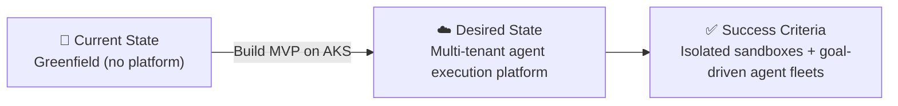

# 📋 Step 1: Requirements - copilot-agent-execution-platform

<strong>📑 Requirements Overview</strong>

- [🎯 Project Overview](#-project-overview)
- [🚀 Functional Requirements](#-functional-requirements)
- [⚡ Non-Functional Requirements (NFRs)](#-non-functional-requirements-nfrs)
- [🔒 Compliance & Security Requirements](#-compliance--security-requirements)
- [💰 Budget](#-budget)
- [🔧 Operational Requirements](#-operational-requirements)
- [🌍 Regional Preferences](#-regional-preferences)
- [📊 Complexity Classification](#-complexity-classification)
- [📋 Summary for Architecture Assessment](#-summary-for-architecture-assessment)
- [References](#references)

> Generated by @requirements agent | 2026-05-12

| ⬅️ Previous | 📑 Index            | Next ➡️                                                        |
| ----------- | ------------------- | -------------------------------------------------------------- |
| —           | [README](README.md) | [02-architecture-assessment.md](02-architecture-assessment.md) |

`iac_tool: Bicep`

## 🎯 Project Overview

| Field                   | Value                                                                                                                                                                              |
| ----------------------- | ---------------------------------------------------------------------------------------------------------------------------------------------------------------------------------- |
| **Project Name**        | copilot-agent-execution-platform                                                                                                                                                   |
| **Project Type**        | Multi-tenant SaaS — agent-orchestration platform                                                                                                                                   |
| **Timeline**            | 2026-05-12 → MVP target ~3 months                                                                                                                                                  |
| **Primary Stakeholder** | Platform Engineering (founding team)                                                                                                                                               |
| **Business Context**    | Platform for spawning isolated, ephemeral execution environments where users launch fleets of GitHub Copilot-backed custom agents that perform code edits, web search, tool/MCP calls, and script execution until a goal is reached. |

### Business Context

| Field               | Value                                                                                                            |
| ------------------- | ---------------------------------------------------------------------------------------------------------------- |
| Industry / Vertical | Technology / SaaS                                                                                                |
| Company Size        | Startup (<50)                                                                                                    |
| Current State       | Greenfield                                                                                                       |
| Migration Source    | N/A                                                                                                              |
| Business Drivers    | Differentiate as agent-execution platform; let users compose Copilot-backed agent fleets with autonomy + safety. |
| Success Criteria    | Users can spin up isolated agent fleets, reach defined goals reliably, with auditable tool/MCP/web/script usage. |

### State Transition

## 🚀 Functional Requirements

### Core Capabilities

| #   | Capability                                                                                          | Priority  | Acceptance Criteria                                                                              |
| --- | --------------------------------------------------------------------------------------------------- | --------- | ------------------------------------------------------------------------------------------------ |
| 1   | Provision isolated, ephemeral execution sandbox per agent fleet                                     | 🔴 Must   | Sandbox starts < 30s, kernel-isolated, auto-destroyed on goal/timeout/idle                       |
| 2   | Launch a fleet of GitHub Copilot-backed agents (preset + user-custom) targeting a goal              | 🔴 Must   | User submits goal + fleet config → agents run until goal reached, max-iterations, or budget cap  |
| 3   | Allow agents to perform code updates inside the sandbox (clone, edit, commit, run tests)            | 🔴 Must   | Git operations succeed; diff persisted to artifact store; test runner output captured            |
| 4   | Allow agents to invoke tools, MCP servers, and run arbitrary scripts within sandbox limits          | 🔴 Must   | Tool/MCP calls logged with input/output; only allowlisted MCP servers reachable                  |
| 5   | Allow agents to perform web search and constrained outbound HTTP                                    | 🔴 Must   | Web search via approved provider; outbound traffic restricted by per-sandbox egress allowlist    |
| 6   | Track agent run state, conversation/decision history, artifacts, and final outcome                  | 🔴 Must   | Each run has immutable record (state, transcript, tool calls, artifacts) retrievable per user    |
| 7   | Per-user / per-tenant isolation of secrets, code, agents, and runs                                  | 🔴 Must   | No cross-tenant data access verified by tests; secrets scoped to tenant in Key Vault             |
| 8   | Goal-completion / stop-condition framework (success, max-steps, budget, human-stop)                 | 🔴 Must   | Each run terminates on first met stop-condition with reason recorded                             |
| 9   | Web UI + API to define goals, configure agents, monitor fleets, stream logs, intervene              | 🔴 Must   | UI shows live agent status; user can pause/stop/resume a run                                     |
| 10  | Custom agent definition (instructions, allowed tools, allowed MCP servers, model, budget)           | 🔴 Must   | Users can create/save/share custom agent definitions; validation against allowlists              |
| 11  | Per-run cost / token / time budget enforcement                                                      | 🔴 Must   | Run halts on budget breach; usage exposed to user                                                |
| 12  | Audit log of every Copilot call, tool call, MCP call, script exec, and outbound HTTP                | 🔴 Must   | Tamper-evident log retained ≥ 90 days; queryable per user/run                                    |
| 13  | Copilot dependency validation gate                                                                    | 🔴 Must   | Before Step 2 sign-off, document and approve the supported Copilot automation model, entitlement checks, quota model, and fallback path for unlicensed/quota-exhausted users |
| 14  | Sandbox exfiltration prevention controls                                                              | 🔴 Must   | Deny-by-default outbound model, DNS policy enforcement, tool schema allowlist, secret redaction, and adversarial exfiltration test suite are implemented and pass |
| 15  | Abuse-prevention and high-risk action safety gates                                                    | 🔴 Must   | Per-tenant/user rate limits, abuse detection, malware/content policy checks, and human approval for risky actions are enforced and audited |
| 16  | Marketplace / library of preset agent templates and tool/MCP bundles                                | 🟡 Should | Users can discover and clone presets                                                             |
| 17  | Inter-agent messaging within a fleet (delegation, review, debate)                                   | 🟡 Should | Defined message bus inside sandbox; ordered, persisted                                           |
| 18  | Bring-your-own MCP server registration (URL + auth)                                                 | 🟢 Could  | Tenant admin can register custom MCP servers under egress allowlist policy                       |

### User Types

| User Type      | Description                                                            | Est. Count        | Access Level                          |
| -------------- | ---------------------------------------------------------------------- | ----------------- | ------------------------------------- |
| End User       | Developer who creates goals, agents, and runs fleets                   | <100 daily        | Tenant-scoped contributor             |
| Tenant Admin   | Manages users, allowlists, MCP servers, budgets for their tenant       | <20               | Tenant admin                          |
| Platform Admin | Platform operator (founders / ops)                                     | <10               | Global admin                          |
| Service        | Background workers, schedulers, telemetry processors                   | N/A               | Workload identity (no human login)    |

### Integrations

| System                     | Direction   | Protocol             | Auth Method                      | SLA                       |
| -------------------------- | ----------- | -------------------- | -------------------------------- | ------------------------- |
| GitHub (OAuth + Copilot)   | Outbound    | REST / OAuth         | GitHub OAuth + per-user PAT/Copilot subscription | Best-effort (vendor)      |
| Approved web search API    | Outbound    | REST                 | API key (Key Vault)              | Best-effort (vendor)      |
| User-allowlisted MCP servers| Outbound    | MCP / HTTP(S) stdio  | OAuth / API key                  | Best-effort               |
| Git remotes (per user)     | Outbound    | HTTPS                | OAuth / PAT                      | Best-effort               |
| Telemetry sinks            | Outbound    | OTLP / HTTPS         | Managed Identity                 | 99.9% (Azure Monitor)     |

### Dependency Validation Gates

| Gate ID | Requirement | Exit Criteria | Owner |
| ------- | ----------- | ------------- | ----- |
| G1-COPILOT-MODEL | Validate GitHub Copilot integration and licensing model for autonomous fleet execution | Legal + architecture approval artifact confirms allowed usage model, API constraints, per-user entitlement checks, and fallback behavior | Product + Architecture |
| G1-COPILOT-QUOTA | Define quota and failure semantics | Per-user and per-tenant quota limits documented; run stop/retry behavior for quota exhaustion is specified and testable | Platform Engineering |

### Data Types

| Category                          | Sensitivity | Est. Volume (MVP) | Retention | Residency |
| --------------------------------- | ----------- | ----------------- | --------- | --------- |
| User-supplied source code         | 🔴 High     | ~10 GB / mo       | 90 d      | EU        |
| Secrets / API keys / OAuth tokens | 🔴 High     | KV-only           | Until rotated | EU    |
| Agent run transcripts / decisions | 🟡 Medium   | ~50 GB / mo       | 90 d      | EU        |
| Tool / MCP / script audit logs    | 🟡 Medium   | ~20 GB / mo       | 365 d     | EU        |
| User profile / billing            | 🔴 High (PII)| < 1 GB           | Account life + 30 d | EU |
| Public preset templates           | 🟢 Low      | < 1 GB            | Indefinite| EU        |

### Architecture Pattern

| Field              | Value                                                                                                              |
| ------------------ | ------------------------------------------------------------------------------------------------------------------ |
| Workload Pattern   | Kubernetes-based multi-tenant platform (microservices control plane + per-tenant sandbox runtime)                  |
| Recommended Option | AKS for sandbox runtime; Container Apps for stateless control-plane services; Service Bus + Cosmos DB for state    |
| Tier               | Balanced (standard SaaS) — cost-aware while keeping security baseline                                              |
| Justification      | Sandbox isolation, per-pod egress, kernel isolation (Kata/gVisor), and dynamic per-fleet scale-out require Kubernetes; control-plane services are stateless HTTP APIs and fit Container Apps well. |

## ⚡ Non-Functional Requirements (NFRs)

| WAF Pillar     | Metric                | Target                                           | Current | Gap        |
| -------------- | --------------------- | ------------------------------------------------ | ------- | ---------- |
| 🔄 Reliability | SLA (control plane)   | 99.5%                                            | N/A     | Greenfield |
| 🔄 Reliability | RTO                   | 24 h                                             | N/A     | Greenfield |
| 🔄 Reliability | RPO                   | 12 h                                             | N/A     | Greenfield |
| ⚡ Performance | UI page load (p95)    | < 2 s                                            | N/A     | Greenfield |
| ⚡ Performance | API response (p95)    | < 500 ms                                         | N/A     | Greenfield |
| ⚡ Performance | Sandbox cold start    | < 30 s (target), < 60 s (max)                    | N/A     | Greenfield |
| ⚡ Performance | Concurrent users      | < 100                                            | N/A     | Greenfield |
| ⚡ Performance | Concurrent sandboxes  | 10–100                                           | N/A     | Greenfield |
| 🔒 Security    | Auth method           | GitHub OAuth (end users); Entra ID (admin/ops)   | —       | —          |
| 🔒 Security    | Encryption            | At rest + in transit (TLS 1.2+)                  | —       | —          |
| 💰 Cost        | Monthly budget        | $1,000–$5,000 / mo                               | —       | —          |
| 🔧 Operations  | Uptime monitoring     | Yes — Azure Monitor + Log Analytics + alerts     | —       | —          |

### Scalability

| Dimension              | Current | 6-Month Projection | 12-Month Projection |
| ---------------------- | ------- | ------------------ | ------------------- |
| Daily active users     | <100    | 500                | 2,000               |
| Concurrent sandboxes   | 10–100  | 200                | 1,000               |
| Run transcripts / day  | <1,000  | 5,000              | 25,000              |
| Audit log volume / day | ~700 MB | 3 GB               | 15 GB               |

## 🔒 Compliance & Security Requirements

### Regulatory Frameworks

<strong>PCI-DSS</strong> — Not Applicable

| Requirement             | Applicability | Notes                                  |
| ----------------------- | ------------- | -------------------------------------- |
| Cardholder data storage | No            | Billing handled by external PCI-DSS provider (e.g., Stripe). |
| Network segmentation    | No            | N/A                                    |
| Encryption requirements | No            | N/A                                    |

<strong>SOC 2</strong> — Not Applicable (MVP), planned post-MVP

| Trust Principle | Applicability | Notes                                                             |
| --------------- | ------------- | ----------------------------------------------------------------- |
| Security        | No (MVP)      | Build controls aligned, defer formal audit                        |
| Availability    | No (MVP)      | 99.5% target acceptable for early access                          |
| Confidentiality | No (MVP)      | Per-tenant isolation enforced; formal SOC 2 deferred              |

<strong>HIPAA</strong> — Not Applicable

| Requirement   | Applicability | Notes                       |
| ------------- | ------------- | --------------------------- |
| PHI handling  | No            | No PHI by policy            |
| BAA required  | No            | N/A                         |
| Audit logging | No            | Audit logs exist for tenant safety, not PHI |

<strong>GDPR</strong> — Applicable

| Requirement      | Applicability | Notes                                                                                             |
| ---------------- | ------------- | ------------------------------------------------------------------------------------------------- |
| EU data subjects | Yes           | EU customer base assumed                                                                          |
| Data residency   | Yes           | All tenant data stored in `swedencentral`; failover `germanywestcentral`                          |
| Right to erasure | Yes           | Account deletion purges runs, transcripts, secrets within 30 d                                    |
| EU Data Boundary | Yes           | Flag any global services (Front Door, Entra External ID, Azure DNS) for EU Data Boundary review   |

<strong>ISO 27001</strong> — Not Applicable (MVP)

| Control Area        | Applicability | Notes                                            |
| ------------------- | ------------- | ------------------------------------------------ |
| Access control      | No (formal)   | RBAC + tenant isolation implemented              |
| Asset management    | No            | Tag-based inventory in Azure                     |
| Incident management | No (formal)   | Lightweight runbook for MVP                      |

### Data Residency

| Requirement              | Value                                                              |
| ------------------------ | ------------------------------------------------------------------ |
| Primary Region           | swedencentral                                                      |
| Data Sovereignty         | EU-only                                                            |
| Cross-region Replication | Not required for MVP (RPO 12 h via backups). Revisit at 12 mo.     |

### EU Data Boundary & Third-Party Transfer Controls

| Dependency | Data Categories Allowed | Control Requirement | Approval Gate |
| ---------- | ----------------------- | ------------------- | ------------- |
| GitHub OAuth/Copilot | User identifiers, entitlement metadata, minimal prompt context | DPA/SCC/legal basis documented; payload minimization enforced | G1-EU-DEPENDENCIES |
| Web search provider | Query text only; no raw secrets/source code | Request redaction and content policy filter before egress | G1-EU-DEPENDENCIES |
| Tenant MCP servers | Tenant-approved data only | Tenant-level allowlist + explicit consent + audit trail | G1-EU-DEPENDENCIES |
| Git remotes | Repository content under tenant ownership | Tenant ownership validation + transport encryption + audit | G1-EU-DEPENDENCIES |

> Gate rule: Architecture cannot advance to Step 4 planning until `G1-EU-DEPENDENCIES` is marked approved with legal and security sign-off.

### Authentication & Authorization

| Requirement       | Value                                                                                  |
| ----------------- | -------------------------------------------------------------------------------------- |
| Identity Provider | GitHub OAuth (end users); Microsoft Entra ID (platform admin & workload identities)    |
| MFA Requirement   | Required for platform admins; enforced by Entra Conditional Access                     |
| RBAC Model        | Application-level RBAC for tenant/user roles; Azure RBAC for platform/workload identities |

### Network Security

| Control                     | Required | Notes                                                             |
| --------------------------- | -------- | ----------------------------------------------------------------- |
| Private endpoints           | ✅       | All data services (Cosmos DB, Storage, Key Vault, ACR, Service Bus) |
| VNet integration            | ✅       | AKS in custom VNet; control-plane Container Apps in VNet-integrated environment |
| Public endpoints acceptable | ❌       | Only Front Door + WAF is public-facing                            |
| WAF required                | ✅       | Azure Front Door Premium + WAF policy on the public ingress       |

### Recommended Security Controls

| Control               | Recommended | User Confirmed | Notes                                                              |
| --------------------- | ----------- | -------------- | ------------------------------------------------------------------ |
| Managed Identity      | yes         | yes            | All workload-to-Azure auth via MI; no shared keys                  |
| Private Endpoints     | yes         | yes            | All data services + ACR + Key Vault                                |
| WAF                   | yes         | yes            | Front Door Premium WAF on public edge                              |
| Key Vault for Secrets | yes         | yes            | Central tenant-scoped secret storage; CSI driver into AKS          |
| Diagnostic Settings   | yes         | yes            | All resources → Log Analytics; export to long-term storage         |
| TLS 1.2 Minimum       | yes         | yes            | Enforced platform-wide; 1.3 preferred where supported              |
| Encryption at Rest    | yes         | yes            | Platform-managed keys for MVP; CMK option deferred                 |
| Network Isolation     | yes         | yes            | NetworkPolicy per sandbox; per-pod egress allowlist; kernel isolation (Kata/gVisor) for sandbox runtime |
| Defender for Cloud    | yes         | yes            | Defender for Containers + Key Vault + Storage enabled              |

### Sandbox Exfiltration Defense Requirements

| Control | Requirement Level | Acceptance Test |
| ------- | ----------------- | --------------- |
| Egress broker/proxy | Must | All outbound traffic from sandbox workloads traverses controlled egress path with policy enforcement |
| DNS policy enforcement | Must | Sandboxes resolve only approved domains; blocked domain attempts are logged |
| Tool and MCP schema allowlist | Must | Tool/MCP requests failing schema/policy validation are rejected and audited |
| Filesystem/process hardening | Must | No privileged containers, no hostPath mounts, seccomp/AppArmor/cap-drop baseline passes |
| Secret redaction | Must | Secrets never appear in transcript/log exports; redaction tests pass |
| Adversarial exfiltration tests | Must | Prompt-injection and malicious MCP scenarios cannot exfiltrate tenant data in test runs |

## 💰 Budget

> [!NOTE]
> The Azure Pricing MCP server generates detailed cost estimates during
> architecture assessment (Step 2). Provide an approximate budget here.

| Field              | Value                                                              |
| ------------------ | ------------------------------------------------------------------ |
| 💰 Monthly Budget  | ~$1,000–$5,000                                                     |
| 📅 Annual Budget   | ~$12,000–$60,000                                                   |
| 🚦 Limit Type      | 🟡 Soft — early-stage SaaS; can negotiate for clear ROI            |
| 📊 Cost Model Pref | Consumption first; Reserved Instances at 12 mo when load stabilizes |

> ⚠️ **Budget tension flagged**: AKS + Defender for Containers + Front Door Premium + Cosmos DB easily exceed $1,000 / mo at low load. Step 2 must size SKUs aggressively (e.g., AKS B-series or Spot node pool, Cosmos DB serverless, Front Door Standard if feasible) and re-confirm with stakeholder before code generation.

### Cost Optimization Priorities

| Priority                         | Selected | Impact |
| -------------------------------- | -------- | ------ |
| Minimize compute costs           | ☑        | High   |
| Prefer consumption-based pricing | ☑        | High   |
| Reserved instances acceptable    | ☐        | Medium (revisit 12 mo) |
| Spot instances for non-critical  | ☑        | High (sandbox node pool candidate) |

### Budget Control Gates

| Gate ID | Requirement | Exit Criteria |
| ------- | ----------- | ------------- |
| G1-BUDGET-CAPS | Define hard platform and tenant spend caps | Budget alerts at 80/100/120% configured and auto-throttle/stop policy documented |
| G1-MVP-CAPACITY | Bind MVP capacity to budget envelope | Max concurrent sandboxes and baseline node profile approved against monthly budget target |

## 🔧 Operational Requirements

### Monitoring & Alerting

| Capability             | Required | Tool / Service                  | Notes                                                       |
| ---------------------- | -------- | ------------------------------- | ----------------------------------------------------------- |
| Application monitoring | ✅       | Application Insights            | Control-plane services + agent runtime telemetry            |
| Log aggregation        | ✅       | Log Analytics                   | All Azure resources + AKS container logs + audit log stream |
| Alert notifications    | ✅       | Email + GitHub Issue webhook    | On-call rotation deferred post-MVP                          |
| Custom dashboards      | ✅       | Azure Monitor Workbooks         | Per-tenant usage + cost + sandbox health                    |

### Abuse Prevention & Safety Controls

| Control | Required | Notes |
| ------- | -------- | ----- |
| Tenant/user rate limits | ✅ | Enforce requests, runs, outbound calls, and MCP invocation limits |
| Risky-action human approval | ✅ | External writes, secret usage, destructive scripts require approval policy |
| Abuse detection pipeline | ✅ | Detect credential-stuffing, spam/scanning patterns, and repeated policy violations |
| Malware/content policy checks | ✅ | Scan script payloads/artifacts and enforce content safety policy |
| Emergency tenant suspend | ✅ | Global and tenant-level kill switches with auditable operator actions |
| Enforcement audit trail | ✅ | Every blocked/throttled/suspended action recorded with actor and reason |

### Support & Maintenance

| Requirement         | Value                                                |
| ------------------- | ---------------------------------------------------- |
| Support Hours       | Best-effort (business hours EU)                      |
| On-call Requirement | No formal on-call for MVP                            |
| Maintenance Windows | Sundays 02:00–06:00 UTC; pre-announced 48 h          |
| Change Management   | Self-service via PR + GitHub Actions; team approval  |

### Backup & Disaster Recovery

| Component                        | Backup Frequency | Retention | Recovery Method                       |
| -------------------------------- | ---------------- | --------- | ------------------------------------- |
| Cosmos DB (run state, agents)    | Continuous (PITR)| 30 d      | Restore via Cosmos PITR               |
| Blob Storage (artifacts, logs)   | Daily snapshots  | 90 d      | Soft-delete + versioning + restore    |
| Key Vault (secrets)              | Soft-delete + purge protection | 90 d | Recover deleted secrets        |
| AKS cluster config / IaC         | On every commit  | Indefinite| Re-deploy from Bicep + Git            |
| User source code (in-sandbox)    | Ephemeral by design — pushed to user-owned remotes | N/A | User-owned Git remote |

## 🌍 Regional Preferences

| Preference         | Value                  | Justification                                                              |
| ------------------ | ---------------------- | -------------------------------------------------------------------------- |
| Primary Region     | swedencentral          | Default EU GDPR-compliant region                                           |
| Failover Region    | germanywestcentral     | EU paired alternative; activated only on regional outage                   |
| Availability Zones | Preferred              | AKS + Cosmos DB zone-redundant where SKU allows; cost trade-off acceptable |

---

## 📊 Complexity Classification

| Field      | Value                                                                                                              |
| ---------- | ------------------------------------------------------------------------------------------------------------------ |
| Complexity | `complex`                                                                                                          |
| Criteria   | >8 resource types (AKS, ACR, Front Door+WAF, Container Apps, Service Bus, Cosmos DB, Storage, Key Vault, VNet+PE, Monitor/LA, optional AOAI/APIM); strong security/network policy surface; multi-tenant isolation requirements; Kubernetes runtime with per-pod egress + kernel isolation. |
| Rationale  | Multi-tenant agent execution platform with sandboxed compute, per-pod egress allowlists, kernel isolation, and broad Azure footprint pushes this beyond `standard`. Multi-pass adversarial review at Step 2 and Step 4 strongly recommended. |

---

## 📋 Summary for Architecture Assessment

### Handoff Summary

| Aspect               | Key Points                                                                                                       |
| -------------------- | ---------------------------------------------------------------------------------------------------------------- |
| Critical Constraints | (1) Per-tenant isolation of code/secrets/runs; (2) Sandbox kernel + network isolation with egress allowlist; (3) $1–5k/mo budget vs. AKS multi-tenant footprint. |
| Key Decisions        | IaC = Bicep; Region = swedencentral; Auth = GitHub OAuth (users) + Entra ID (admin); Runtime = AKS; State = Cosmos DB; Queue = Service Bus; Edge = Front Door + WAF. |
| Open Risks           | (1) Budget vs. SKU selection — Step 2 must justify; (2) Tooling choice for egress enforcement model (Calico / Cilium / Azure NPM); (3) Operational overhead of mandatory human-approval gates for risky actions. |
| Recommended Pattern  | Kubernetes-based multi-tenant platform with microservices control plane + event-driven agent jobs.               |
| Budget Envelope      | $1,000–$5,000 / month (soft cap, negotiable).                                                                    |

### Requirements Completeness

| Section                  | Status | Notes                                                                |
| ------------------------ | ------ | -------------------------------------------------------------------- |
| Project Overview         | ✅     | Captured                                                             |
| Functional Requirements  | ✅     | 15 must, 2 should, 1 could (must-fix items incorporated)             |
| NFRs                     | ✅     | SLA / RTO / RPO / perf / scale captured                              |
| Compliance & Security    | ✅     | GDPR controls and EU transfer gates explicitly defined; SOC 2 / ISO 27001 deferred for post-MVP |
| Budget                   | ⚠️     | Budget tension with AKS footprint — Step 2 must reconcile            |
| Operational Requirements | ✅     | Monitoring + DR + maintenance windows captured                       |

---

## References

> [!NOTE]
> 📚 The following Microsoft Learn resources provide additional guidance.

| Topic                      | Link                                                                                                |
| -------------------------- | --------------------------------------------------------------------------------------------------- |
| Well-Architected Framework | [Overview](https://learn.microsoft.com/azure/well-architected/)                                     |
| Azure Regions              | [Products by Region](https://azure.microsoft.com/explore/global-infrastructure/products-by-region/) |
| Compliance Offerings       | [Azure Compliance](https://learn.microsoft.com/azure/compliance/)                                   |
| AKS Multi-tenancy          | [AKS Multi-tenancy guidance](https://learn.microsoft.com/azure/aks/operator-best-practices-multi-region) |
| Sandbox Isolation          | [Pod Sandboxing (Kata)](https://learn.microsoft.com/azure/aks/use-pod-sandboxing)                   |
| EU Data Boundary           | [EU Data Boundary](https://learn.microsoft.com/privacy/eudb/eu-data-boundary-overview)              |

---

_Requirements captured using [plan-requirements.prompt.md](../../.github/prompts/plan-requirements.prompt.md) template_

---

| ⬅️ — | 🏠 [Project Index](README.md) | ➡️ [02-architecture-assessment.md](02-architecture-assessment.md) |
| ---- | ----------------------------- | ----------------------------------------------------------------- |

