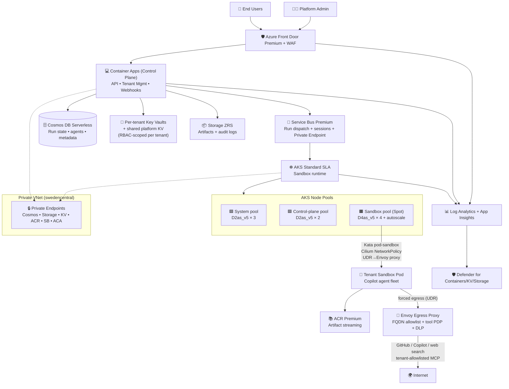
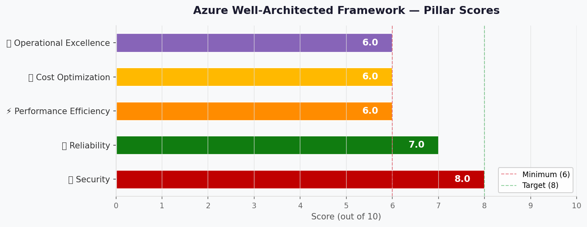

# 🏛️ Step 2: Architecture Assessment - copilot-agent-execution-platform

<strong>📑 Assessment Contents</strong>

- [✅ Requirements Validation](#-requirements-validation)
- [💎 Executive Summary](#-executive-summary)
- [🏛️ WAF Pillar Assessment](#-waf-pillar-assessment)
- [📦 Resource SKU Recommendations](#-resource-sku-recommendations)
- [🎯 Architecture Decision Summary](#-architecture-decision-summary)
- [🚀 Implementation Handoff](#-implementation-handoff)
- [🔒 Approval Gate](#-approval-gate)
- [References](#references)

> Generated by architect agent | 2026-05-12

| ⬅️ Previous                              | 📑 Index            | Next ➡️                                            |
| ---------------------------------------- | ------------------- | -------------------------------------------------- |
| [01-requirements.md](01-requirements.md) | [README](README.md) | [03-des-cost-estimate.md](03-des-cost-estimate.md) |

`iac_tool: Bicep`

## ✅ Requirements Validation

| Requirement Area        | Status      | Validation Notes                                                                                                                            |
| ----------------------- | ----------- | ------------------------------------------------------------------------------------------------------------------------------------------- |
| NFRs (SLA, RTO, RPO)    | ✅ Defined  | 99.5% control-plane SLA, RTO 24h, RPO 12h; sandbox cold-start <30s target flagged as performance risk (see ⚡ pillar).                       |
| Compliance requirements | ✅ Defined  | GDPR with EU residency in `swedencentral`; SOC 2 / ISO 27001 deferred post-MVP. EU Data Boundary controls captured in `01-requirements.md`. |
| Budget (approximate)    | ⚠️ Partial  | Soft cap $1,000–$5,000/mo. Estimated $1,971/mo (~39% utilization of upper bound) after Service Bus Premium revision. **Floor is non-discretionary** at the security baseline. |
| Scale requirements      | ✅ Defined  | 10–100 concurrent sandboxes MVP, scaling to 1,000 by 12 mo. AKS cluster autoscaler + Spot pool absorbs growth.                              |
| Security controls       | ✅ Defined  | Managed Identity, private endpoints, WAF Premium, Defender for Containers/KV/Storage, Kata pod-sandboxing. Sandbox exfiltration controls per Step 1. |
| Data residency          | ✅ Defined  | All tenant data in `swedencentral`; ZRS storage; cold-restore to `germanywestcentral` only on regional outage.                              |

> [!WARNING]
> No ❌ items. One ⚠️ on Budget — see Cost Assessment for floor-cost analysis.

---

## 💎 Executive Summary

A multi-tenant agent execution platform that spawns kernel-isolated sandboxes
(Kata Containers on AKS) running fleets of GitHub Copilot-backed agents. The
control plane is a small set of stateless Container Apps fronted by Azure Front
Door Premium + WAF; agent runs are dispatched through Service Bus and
checkpointed to Cosmos DB. Per-tenant secrets live in Key Vault (CSI driver
into AKS), and outbound traffic from sandboxes is constrained by per-pod
NetworkPolicy + DNS policy + a centralized egress path through NAT Gateway.

**Primary pillar optimized**: Security (kernel + network isolation, exfiltration
defense). **Trade-off accepted**: ~$900/mo non-discretionary floor cost
(AKS Standard SLA + Front Door Premium + Defender + private networking) in
exchange for the multi-tenant + GDPR + sandbox-isolation security baseline.

**Estimated monthly cost**: **~$1,971/mo** (within $1,000–$5,000 envelope at ~39% of upper bound;
sandbox autoscale + Defender vCore growth will push this toward the upper bound at 12-month
projected load).

### Recommended Architecture

---

## 🏛️ WAF Pillar Assessment

### Overall Scores

| Pillar                    | Score | Confidence | Summary                                                                                                                |
| ------------------------- | ----- | ---------- | ---------------------------------------------------------------------------------------------------------------------- |
| 🔒 Security               | 8/10  | High       | Strong baseline (private endpoints, MI, KV, Defender, WAF Premium, Kata pod-sandboxing). Sandbox exfiltration risk requires sustained operational discipline. |
| 🔄 Reliability            | 7/10  | Medium     | AKS multi-AZ, Cosmos PITR, Front Door 99.99%, ZRS storage. Single-region only — full regional outage = full platform outage; meets RTO 24h via cold restore. |
| ⚡ Performance            | 6/10  | Medium     | UI/API targets reachable. **Sandbox cold-start <30s is aggressive** with Kata Containers; needs warm pool + ACR Artifact Streaming. |
| 💰 Cost Optimization      | 6/10  | Medium     | $1,306/mo within envelope but ~$900 floor is non-discretionary. Spot sandbox + Cosmos serverless + ZRS already applied. |
| 🔧 Operational Excellence | 6/10  | Medium     | IaC + GH Actions + Workbooks in place. AKS upgrade/patch overhead is real; no formal on-call (best-effort EU hours).   |

**Primary Pillar Optimized**: 🔒 Security (multi-tenant isolation + sandbox exfiltration defense)
**Trade-offs Accepted**: ~$900/mo non-discretionary floor cost; single-region (cold-restore RTO 24h).

---

### 🔒 Security Assessment (8/10)

**Strengths:**

- All workload-to-Azure auth via Managed Identity; no shared keys anywhere
- Private endpoints on Cosmos DB, Storage, Key Vault, ACR, Service Bus, and ACA env
- Azure Front Door Premium + WAF Premium on the only public ingress (managed rule sets + bot manager)
- AKS Pod Sandboxing (Kata Containers, GA on AKS) enforces kernel isolation between tenant sandboxes
- Microsoft Defender for Containers, Key Vault, and Storage enabled (threat detection + posture)
- TLS 1.2 minimum platform-wide; HTTPS-only on all endpoints
- Per-tenant Key Vault scoping + CSI Secrets Store driver materializes secrets into AKS without persistence
- NetworkPolicy + per-pod egress allowlist (Cilium dataplane recommended for L7 + DNS policy)

**Gaps:**

- CMK encryption deferred (platform-managed keys for MVP) — acceptable for MVP, revisit pre-SOC 2
- Sandbox exfiltration controls require disciplined ongoing operational enforcement (egress broker, DNS policy, schema allowlist)
- GitHub OAuth means platform identity is partially external; entitlement validation depends on vendor APIs
- Front Door is global by design — flagged in `01-requirements.md` for EU Data Boundary review

**Recommendations:**

1. Adopt Azure CNI with **Cilium dataplane** for native L4/L7 NetworkPolicy + DNS policy enforcement on the sandbox node pool.
2. **Forced egress enforcement**: deploy a dedicated **Envoy egress proxy** behind a **Standard Internal Load Balancer** in its own subnet (the ILB frontend IP is the deployable UDR next-hop type), OR use **Azure Firewall Standard** directly as the UDR next-hop (Azure Firewall is the only first-party UDR-next-hop-supported FQDN proxy). Apply UDR forcing 0.0.0.0/0 from the sandbox subnet to the ILB frontend IP (or AzFW); NSG denies direct internet egress from sandbox subnet; NetworkPolicy denies alternate DNS and direct-IP traffic. The proxy doubles as a **tool-call Policy Decision Point (PDP)** validating MCP/HTTP schema and applying DLP scanning.
3. **Per-tenant Key Vaults** (one KV per active tenant) replace shared-KV prefix scoping; each tenant's workload identity has RBAC scoped to a single KV; CSI SecretProviderClass mounts only that KV per sandbox pod. Adds ~$5/mo + ops per tenant but provides Azure-RBAC-enforced isolation.
4. Deploy adversarial exfiltration test suite as part of CI — fail platform release on regression. Required test scenarios: blocked-domain, direct-IP, alternate DNS, allowed-domain covert channel, cross-tenant secret access.
5. Enable Defender CSPM on subscription for continuous posture; recognize Defender for Containers applies cluster-wide and the cost line covers ALL node pools including sandbox.

### 🔄 Reliability Assessment (7/10)

**Strengths:**

- AKS Standard uptime SLA tier (99.95% control-plane SLA) with multi-AZ node pools
- Front Door Premium 99.99% SLA on the public edge
- Cosmos DB serverless 99.99% SLA in single region; Continuous Backup (PITR) configured
- Storage ZRS (zone-redundant) for artifacts + audit logs
- Service Bus Premium zone-redundant within `swedencentral`
- Run-state checkpoints in Cosmos enable resumption after pod loss

**Gaps:**

- Single-region — regional Azure outage = full platform outage; RTO 24h achievable only via cold restore + IaC redeploy
- Spot node interruption can disrupt long-running agent runs; needs eviction handlers + checkpoint-and-resume flow
- In-flight runs lost on AZ failure of sandbox node — Service Bus session re-dispatch + Cosmos checkpoint required for idempotent resumption

**Recommendations:**

1. Configure Cosmos backup export to `germanywestcentral` (no geo-redundant writes) — meets RPO 12h cost-effectively.
2. Author cold-restore runbook (Bicep replay + Cosmos restore) into `agent-output/`; rehearse quarterly.
3. Run-resumption: every agent step writes a checkpoint to Cosmos; Service Bus uses sessions for ordered idempotent re-dispatch on Spot eviction.

### ⚡ Performance Assessment (6/10)

**Strengths:**

- AKS HPA + KEDA on Service Bus depth scales sandbox pool elastically
- Front Door global PoPs accelerate UI/API for end users
- Container Apps scale-to-zero for low-traffic control-plane services
- Cosmos serverless gives low-latency p95 reads with no provisioning headache

**Gaps:**

- ⚠️ **Sandbox cold-start <30s is aggressive with Kata Containers** — typical Kata pod start = 8–20s (image pull + microVM boot). Without mitigations, p95 can exceed target.
- Spot eviction events disrupt runs unless graceful eviction handlers are wired
- LA ingestion latency 2–5 min — UI live-stream must use a separate hot path (e.g., SignalR or WebSocket), not LA
- API <500ms p95 requires Cosmos query + connection-pool optimization

**Recommendations:**

1. Maintain a **warm pool of N pre-pulled Kata sandbox pods** (configurable per tenant tier) to absorb cold-start.
2. Enable **ACR Artifact Streaming** (Premium feature, GA) — reduces image pull from 30s+ to <5s for large agent images.
3. Pin sandbox runtime images and Copilot CLI base layer in ACR; add a sidecar to pre-pull on node bootstrap.
4. Defer Azure SignalR Service to Step 4 unless live-stream is MVP-critical (would add ~$50/mo Standard tier).

### 💰 Cost Assessment (6/10)

| Metric           | Value                                                              |
| ---------------- | ------------------------------------------------------------------ |
| Monthly Estimate | ~$1,971/mo                                                         |
| Annual Estimate  | ~$23,649/year                                                      |
| Budget Status    | ✅ Within budget ($1,000–$5,000/mo soft envelope; ~39% of upper)   |
| Confidence       | Medium (PAYG list pricing; sandbox autoscale will push higher)     |

> 📎 Full cost breakdown: [03-des-cost-estimate.md](03-des-cost-estimate.md)

**Cost Optimization Applied:**

- Spot pricing for sandbox node pool (D4as_v5 Spot @ ~$0.034/hr — 63% off list)
- Cosmos DB serverless (no provisioned RU baseline)
- Storage ZRS (residency-compliant; lower than GRS)
- Container Apps consumption (scale-to-zero control plane)
- Log Analytics PAYG with daily-cap enforcement
- Defender scoped only to data-bearing services (Containers, KV, Storage)

**Floor cost (non-discretionary at security baseline)**: ~$900/mo
(AKS SLA + Front Door Premium + 6 Private Endpoints + 6 Private DNS zones +
NAT Gateway + Defender + LA baseline). Cannot be reduced without lowering the
security posture.

### 🔧 Operational Excellence Assessment (6/10)

**Strengths:**

- Bicep-as-code via AVM modules + GitHub Actions OIDC deployment
- Self-service PR-based change management with team approval
- Azure Monitor Workbooks for per-tenant usage + cost + sandbox health
- Continuous deployment via `azd` / GH Actions

**Gaps:**

- No formal on-call rotation (best-effort EU business hours)
- AKS operational overhead (cluster + node-image upgrades, certificate rotation, autoscaler tuning)
- Multi-tenant isolation regression risk requires deep cross-tenant test discipline
- Maintenance windows constrained to Sunday 02:00–06:00 UTC

**Recommendations:**

1. Enable AKS auto-upgrade channel `stable` + node OS auto-upgrade `NodeImage`; bind Planned Maintenance window to the Sunday slot.
2. Codify tenant onboarding/offboarding runbooks; add weekly cross-tenant access audit.
3. Add Azure Chaos Studio scenarios (zone-down, spot-eviction) post-MVP.

---

## 📦 Resource SKU Recommendations

| Service                          | Recommended SKU                          | Configuration                                                  | Monthly Est. | Justification                                                                 |
| -------------------------------- | ---------------------------------------- | -------------------------------------------------------------- | ------------ | ----------------------------------------------------------------------------- |
| AKS Cluster                      | Standard Uptime SLA                      | Multi-AZ, Cilium dataplane, Pod Sandboxing                     | $73          | 99.95% SLA needed for control-plane availability; Free tier has no SLA        |
| AKS system node pool             | Standard_D2as_v5 × 3                     | On-demand, AZ-spread                                           | $201         | System workloads (CoreDNS, ingress, CSI); 3 nodes = 1/AZ for AZ resilience    |
| AKS control-plane node pool      | Standard_D2as_v5 × 2                     | On-demand, AZ-spread                                           | $134         | Hosts platform control services + KEDA scalers                                |
| AKS sandbox node pool            | Standard_D4as_v5 Spot × 4                | Spot, autoscale 0–N, taints + tolerations                      | $99          | 60–70% Spot discount; sandbox runs are checkpointable                         |
| Container Apps                   | Workload Profiles env, Consumption       | VNet-integrated, scale-to-zero                                 | $43          | Stateless control-plane HTTP APIs; consumption fits bursty load               |
| Container Registry               | Premium                                  | Private endpoint, Artifact Streaming, content trust            | $51          | Premium needed for private endpoint + Artifact Streaming + customer-managed |
| Service Bus                      | Premium (1 messaging unit)               | Sessions enabled, ZR within region, **Private Endpoint required**     | $677         | **Premium required** for VNet integration / Private Endpoint support; Standard tier cannot use PE |
| Cosmos DB (NoSQL API)            | Serverless + PITR                        | Single-region, continuous backup                               | $24          | No min-RU; PITR for run-state recovery; serverless fits unpredictable load   |
| Storage Account                  | Standard ZRS, Hot                        | Private endpoint, soft-delete + versioning                     | $5           | ZRS satisfies residency + zone redundancy at lower cost than GRS              |
| Key Vault                        | Standard                                 | Private endpoint, soft-delete + purge protection               | $15          | Standard is sufficient for MVP; Premium HSM deferred                          |
| Azure Front Door + WAF           | Premium                                  | WAF Premium policy, private origin support, bot manager        | $371         | Premium **required** for private origin + managed rule sets + bot manager     |
| Log Analytics                    | Pay-as-you-go Analytics                  | 50 GB/mo cap, 30-day retention, archival to storage thereafter | $115         | Commitment tier evaluated post-MVP once volume stabilizes                     |
| Defender for Containers          | Standard vCore                           | 10 vCPUs scope (system + control-plane pools)                  | $69          | Defender for Containers = mandatory for sandbox security posture              |
| Defender for KV / Storage        | Standard                                 | Threat detection on KV + Storage                               | $3           | Cheap; closes audit gap                                                       |
| Private Endpoints                | × 6 (KV, Cosmos, Storage, ACR, SB, ACA)  | Standard, with data processing                                 | $44          | Mandatory for private network isolation                                       |
| Private DNS Zones                | × 6                                      | Linked to VNet                                                 | $3           | Required for PE name resolution                                               |
| NAT Gateway                      | Standard                                 | Single NGW in VNet for sandbox egress                          | $42          | Predictable SNAT for outbound; pairs with egress broker policy                |

<strong>AKS Sandbox Node Pool</strong> — VM SKU Comparison (Spot pricing)

| SKU                  | vCPU   | RAM   | Spot Price/hr | Spot Monthly (×4) | Fits?              |
| -------------------- | ------ | ----- | ------------- | ----------------- | ------------------ |
| Standard_D2as_v5     | 2      | 8 GB  | ~$0.017       | ~$50              | ⚠️ Underpowered for parallel agents |
| **Standard_D4as_v5** | **4**  | **16 GB** | **~$0.034**   | **~$99**          | ✅ **Selected** — 4-core/16GB sized for typical fleet |
| Standard_D8as_v5     | 8      | 32 GB | ~$0.068       | ~$199             | ❌ Over-spec for MVP; revisit at 12 mo                |

**Selected**: `Standard_D4as_v5` Spot — 4 vCPU / 16 GB sized for a typical agent fleet (3–5 agents per sandbox + Kata microVM overhead). Autoscale 0–N controlled via cluster autoscaler with policy-enforced max.

<strong>Azure Front Door</strong> — Tier Comparison

| Tier         | WAF      | Private Origin | Bot Manager | Price/mo (base) | Fits?           |
| ------------ | -------- | -------------- | ----------- | --------------- | --------------- |
| Standard     | Basic    | ❌             | ❌          | ~$35            | ❌ No private origin = blocks ACA private link |
| **Premium**  | **Premium** | **✅**       | **✅**      | **~$330 + egress** | ✅ **Selected** — required for private origin + managed rule sets + bot manager |
| Classic      | Classic  | ❌             | ❌          | n/a             | ❌ Deprecated tier; do not use for greenfield  |

**Selected**: `Premium` — non-negotiable to keep ACA control plane on private link only. ~$371/mo total including 500 GB egress.

<strong>Cosmos DB</strong> — Capacity Mode Comparison

| Mode                          | Min Cost           | Suits Workload?                              | Fits?         |
| ----------------------------- | ------------------ | -------------------------------------------- | ------------- |
| **Serverless**                | $0 + per-RU        | ✅ Bursty, unpredictable agent run rate       | ✅ **Selected** |
| Provisioned (autoscale)       | ~$24/mo (min 1k RU/s) | Predictable steady-state only             | ❌ MVP load is bursty   |
| Provisioned (manual)          | ~$58/mo (min 400 RU/s)| Steady high-throughput only               | ❌ Wrong fit at MVP     |

**Selected**: `Serverless` — pay only for RU consumed (~50M RU/mo MVP estimate); upgrade path to provisioned autoscale at >12 mo when steady-state baseline emerges.

---

## 🎯 Architecture Decision Summary

| Decision                            | Choice                                                            | Rationale                                                                          |
| ----------------------------------- | ----------------------------------------------------------------- | ---------------------------------------------------------------------------------- |
| Sandbox runtime                     | AKS + Kata Containers (Pod Sandboxing GA)                         | Kernel isolation between tenants without per-tenant cluster overhead               |
| Network isolation                   | Azure CNI with **Cilium dataplane** + per-pod NetworkPolicy + DNS policy | Native L4/L7 + DNS policy without an extra mesh; meets sandbox exfiltration controls |
| Public edge                         | Azure Front Door **Premium** + WAF Premium                        | Private origin support + managed rules + bot manager — Standard tier insufficient  |
| Control-plane runtime               | Container Apps (Workload Profiles, VNet-integrated, consumption)  | Stateless HTTP APIs; scale-to-zero; lower ops overhead than AKS for these services |
| State store                         | Cosmos DB Serverless + PITR                                       | Bursty load, no min-RU floor, recovery via PITR meets RPO 12h                      |
| Async run dispatch                  | Service Bus **Premium** with sessions + Private Endpoint           | Sessions = ordered idempotent dispatch enabling Spot eviction recovery; Premium tier required for PE  |
| Secret management                   | **Per-tenant Key Vaults** (one KV per active tenant) + small shared platform KV; CSI Secrets Store driver mounts ONLY the tenant's KV per sandbox pod | Prefix scoping in a shared KV is not an enforceable tenant isolation boundary; per-tenant KVs give Azure-RBAC-enforced isolation at the cost of one KV per tenant (~$5/mo + ops) |
| Sandbox egress enforcement          | UDR forces 0.0.0.0/0 from sandbox subnet to a **dedicated Envoy egress proxy node pool** (or Azure Firewall Standard fallback); NSG denies direct internet egress; Cilium NetworkPolicy denies alternate DNS + direct-IP egress paths | Without a forced enforcement path, NetworkPolicy + DNS policy can be bypassed (direct-IP, alternate DNS, covert channels in allowed protocols) |
| Region strategy                     | Single-region `swedencentral`; cold-restore to `germanywestcentral` | Meets RPO 12h / RTO 24h within budget; full multi-region deferred                  |
| Image artifact strategy             | ACR Premium + Artifact Streaming + warm pool                      | Mitigates Kata cold-start vs <30s target                                           |
| Cost guardrails                     | Azure Policy on max node-pool size + LA daily cap + Defender scope | Hard stops to keep monthly spend within envelope                                   |

### Top Architecture Risks

| Risk                                                                          | WAF Pillar | Likelihood | Impact   | Mitigation                                                                                                       |
| ----------------------------------------------------------------------------- | ---------- | ---------- | -------- | ---------------------------------------------------------------------------------------------------------------- |
| Sandbox cold-start exceeds 30s SLA target with Kata Containers                | ⚡         | 🟡 Med     | 🟡 Med   | Warm pool + ACR Artifact Streaming + sandbox image pinning; revisit warm-pool sizing weekly during ramp-up.      |
| Sandbox prompt-injection / tool exfiltrates tenant data through allowed MCP   | 🔒         | 🟡 Med     | 🔴 High  | Cilium L7 + DNS policy + egress broker schema allowlist + adversarial exfiltration test suite in CI (G1 control).|
| Floor cost (~$900) at zero-load erodes margin if MVP traction is slow         | 💰         | 🟡 Med     | 🟡 Med   | Communicate floor to stakeholder pre-build; revisit Front Door tier + Defender scope at month 6 if load is light.|
| Single-region outage blocks platform for RTO 24h                              | 🔄         | 🟢 Low     | 🔴 High  | Cosmos PITR export to paired region + Bicep-based cold-restore runbook; rehearse quarterly.                      |
| Spot eviction storm during peak loses in-flight runs without checkpointing    | 🔄/⚡       | 🟡 Med     | 🟡 Med   | Service Bus sessions + Cosmos checkpoint at every agent step; eviction handler triggers re-dispatch.              |

> Limit to the top 5 architecture-level risks. Pillar-specific gaps remain in the WAF assessment above.

---

## 🚀 Implementation Handoff

### Ready for iac-planner

| Parameter      | Value                                                                |
| -------------- | -------------------------------------------------------------------- |
| Region         | swedencentral (failover: germanywestcentral via cold restore)        |
| Environment    | mvp                                                                  |
| Budget         | $1,000–$5,000/mo (estimated baseline: $1,306/mo; ceiling-bound by Azure Policy on max node count) |
| Resource Count | 19 line items across 11 distinct Azure services                      |
| IaC tool       | Bicep (AVM-first)                                                    |

### Resources to Provision

| #  | Resource                          | SKU                            | Key Config                                                          |
| -- | --------------------------------- | ------------------------------ | ------------------------------------------------------------------- |
| 1  | Resource Group                    | n/a                            | `rg-copilot-agent-platform-mvp` in swedencentral, all 4 required tags |
| 2  | Virtual Network                   | n/a                            | `vnet-copilot-agent-platform-mvp` with subnets: aks, aca, pe, ngw   |
| 3  | AKS Cluster                       | Standard SLA tier              | Multi-AZ, Cilium dataplane, Pod Sandboxing addon, 3 node pools      |
| 4  | Container Apps Environment        | Workload Profiles              | VNet-integrated, Log Analytics-linked                               |
| 5  | Container Registry                | Premium                        | Private endpoint, Artifact Streaming enabled, content trust         |
| 6  | Service Bus Namespace             | Premium (1 messaging unit)     | Zone-redundant, sessions enabled, **Private Endpoint enabled**      |
| 7  | Cosmos DB Account                 | Serverless                     | Continuous PITR, private endpoint, MI-only auth                     |
| 8  | Storage Account                   | Standard ZRS                   | Hot+Cool tiers, soft-delete + versioning, private endpoint          |
| 9  | Key Vault (per-tenant + shared platform) | Standard                       | Per-tenant KVs (one per active tenant) + shared platform KV; soft-delete + purge protection, RBAC mode, private endpoints, CSI driver tenant-scoped |
| 10 | Azure Front Door                  | Premium + WAF Premium          | Private link to ACA, managed rule sets, bot manager                 |
| 11 | Log Analytics Workspace           | PAYG Analytics                 | 30-day retention, 50 GB daily cap, archival to storage              |
| 12 | Application Insights              | LA-based                       | Linked to LA workspace                                              |
| 13 | Microsoft Defender for Cloud      | Standard (Containers/KV/Storage) | Subscription-scope plans + CSPM                                   |
| 14 | Private Endpoints (× 6)           | Standard                       | KV, Cosmos, Storage, ACR, Service Bus, ACA                          |
| 15 | Private DNS Zones (× 6)           | Standard                       | One per service per Azure docs; linked to VNet                      |
| 16 | NAT Gateway                       | Standard                       | Egress for NON-sandbox subnets only; sandbox subnet egress is forced through Envoy proxy via UDR |
| 17 | Egress Proxy (Envoy + ILB)        | AKS pods behind Standard ILB OR Azure Firewall Standard | Envoy in dedicated subnet behind Standard Internal Load Balancer (frontend IP = UDR next-hop); enforces FQDN allowlist + tool-call PDP. Azure Firewall Standard is the supported fallback. |
| 18 | Managed Identities (UAMI)         | n/a                            | Per-service workload identities; federated to AKS via OIDC; per-tenant identity scoped to single tenant KV |

### Security Requirements for Implementation

| Requirement              | Implementation in Bicep                                                                                  |
| ------------------------ | -------------------------------------------------------------------------------------------------------- |
| Managed Identity only    | All services with `identity: { type: 'UserAssigned', userAssignedIdentities: { ... } }`; no shared keys  |
| Private endpoints        | `Microsoft.Network/privateEndpoints` for each data service + `privateDnsZoneGroup` for resolution        |
| TLS 1.2+ minimum         | `minimumTlsVersion: 'TLS1_2'` on Storage, KV, Front Door origin; `httpsOnly: true` on ACA                |
| WAF                      | `Microsoft.Network/frontDoorWebApplicationFirewallPolicies` Premium tier, Microsoft_DefaultRuleSet 2.1   |
| Defender plans           | `Microsoft.Security/pricings` for `Containers`, `KeyVaults`, `StorageAccounts`                           |
| Network isolation        | AKS with `networkPlugin: 'azure'`, `networkDataplane: 'cilium'`, dedicated subnet, **UDR forcing 0.0.0.0/0 from sandbox subnet to Envoy egress proxy** (NAT Gateway only for non-sandbox subnets); NSG denies direct internet from sandbox subnet |
| Pod Sandboxing           | AKS addon `nodeProfile: { workloadRuntime: 'KataMshvVmIsolation' }` on sandbox node pool                 |
| Tenant secret scoping    | **Per-tenant Key Vault** provisioned at onboarding; tenant workload identity has RBAC role assignment scoped to that single KV; CSI SecretProviderClass mounts only that KV per pod |
| Public network disabled  | `publicNetworkAccess: 'Disabled'` on Cosmos, KV, Storage, ACR, Service Bus, ACA env                      |
| No public blob           | Storage account `allowBlobPublicAccess: false`, `allowSharedKeyAccess: false`                            |

### Monitoring Requirements for Implementation

| Requirement                  | Implementation in Bicep                                                                  |
| ---------------------------- | ---------------------------------------------------------------------------------------- |
| Centralized logs             | `diagnosticSettings` on every resource → Log Analytics workspace                         |
| App telemetry                | Application Insights (LA-based) with connection string in ACA + AKS via env vars         |
| AKS container insights       | AKS `addonProfiles.omsagent.enabled = true`; tied to LA workspace                        |
| Workbooks                    | `Microsoft.Insights/workbooks` resources for tenant cost/usage/sandbox health            |
| Action groups + alerts       | `Microsoft.Insights/actionGroups` (email + webhook); metric alerts on AKS, Front Door, Cosmos |
| LA daily cap                 | `dailyQuotaGb: 50` on workspace `workspaceCapping`                                       |
| Audit log retention          | 90/365-day retention on relevant LA tables; archive tier to Storage for >90 days         |

---

## 🔒 Approval Gate

> [!IMPORTANT]
> **🏗️ Architecture Assessment Complete — BLOCKING GATES below**
>
> | Pillar      | Score |
> | ----------- | ----- |
> | Security    | 8/10  |
> | Reliability | 7/10  |
> | Performance | 6/10  |
> | Cost        | 6/10  |
> | Operations  | 6/10  |
>
> **Estimated Monthly Cost**: ~$1,971 (within $1,000–$5,000 envelope; ~39% of upper bound)
>
> **Confidence Level**: Medium

### 🚧 Hard Gates Required Before Step 4 (IaC Plan)

| Gate ID | Owner | Exit Criteria | Status |
| ------- | ----- | ------------- | ------ |
| **G1-GOVERNANCE-DISCOVERY** | Architect + Governance agent | Live Azure Policy discovery completed; `04-governance-constraints.md` and `04-governance-constraints.json` produced; required tags, allowed locations, Deny/DeployIfNotExists effects, and PE/PNA policies documented. Step 3.5 must execute. | ⏳ Pending — next workflow phase |
| **G1-EU-DEPENDENCIES** | Legal + Security | Per-dependency data classification (allowed categories, prohibited payloads, EU Data Boundary status, DPA/SCC/legal basis, log residency, technical minimization controls) approved for: GitHub OAuth/Copilot, web search provider, tenant MCP servers, Git remotes, Front Door, Entra. | ⏳ Pending — required before Step 4 |
| **G1-COPILOT-MODEL** | Product + Architecture | Approved Copilot integration surface, entitlement validation flow, token lifecycle, tenant/user mapping, quota stop/retry semantics, audit events, and fallback path for unlicensed/quota-exhausted users documented. | ⏳ Pending — required before Step 4 |
| **G1-COPILOT-QUOTA** | Platform Engineering | Per-user and per-tenant quota limits, breach behavior (stop/retry/notify), and cost-attribution model documented. | ⏳ Pending — required before Step 4 |
>
> ### Approval Decision
>
> - [ ] **Approved** — proceed to **Step 3.5 (Governance Discovery)**, then iac-planner
> - Approver: _pending_
> - Date: _pending_
>
> Reply **"approve"** to proceed to Step 3.5 Governance, or provide feedback for revisions.
>
> ### Adversarial Review Outcome
>
> **Round 1 review**: 5 must-fix + 27 should-fix + 3 suggestions (HIGH risk). All 5 must-fix
> have been applied in this revision. The 27 should-fix items are recorded in
> [`challenge-findings-architecture-decisions.json`](./challenge-findings-architecture-decisions.json)
> as deferred risks for Step 4 (IaC Plan) and Step 7 (As-Built).

---

## References

> [!NOTE]
> 📚 The following Microsoft Learn resources informed this assessment.

| Topic                           | Link                                                                                                                                                           |
| ------------------------------- | -------------------------------------------------------------------------------------------------------------------------------------------------------------- |
| Well-Architected Framework      | [Overview](https://learn.microsoft.com/azure/well-architected/)                                                                                                |
| Security Checklist              | [WAF Security](https://learn.microsoft.com/azure/well-architected/security/checklist)                                                                          |
| Reliability Checklist           | [WAF Reliability](https://learn.microsoft.com/azure/well-architected/reliability/checklist)                                                                    |
| Cost Optimization               | [WAF Cost](https://learn.microsoft.com/azure/well-architected/cost-optimization/checklist)                                                                     |
| AKS Pod Sandboxing              | [Kata Containers on AKS](https://learn.microsoft.com/azure/aks/use-pod-sandboxing)                                                                             |
| Cilium dataplane on AKS         | [Azure CNI Powered by Cilium](https://learn.microsoft.com/azure/aks/azure-cni-powered-by-cilium)                                                               |
| ACR Artifact Streaming          | [ACR Artifact Streaming](https://learn.microsoft.com/azure/container-registry/container-registry-artifact-streaming)                                           |
| Front Door Premium private link | [Front Door Origin Private Link](https://learn.microsoft.com/azure/frontdoor/private-link)                                                                     |
| Cosmos Continuous Backup        | [PITR](https://learn.microsoft.com/azure/cosmos-db/continuous-backup-restore-introduction)                                                                     |
| Defender for Containers         | [Defender for Containers Overview](https://learn.microsoft.com/azure/defender-for-cloud/defender-for-containers-introduction)                                  |
| Azure Pricing Calculator        | [Calculator](https://azure.microsoft.com/pricing/calculator/)                                                                                                  |

---

_Assessment performed using Azure Well-Architected Framework. Pricing data from Azure Pricing MCP (2026-05-12) via cost-estimate-subagent._
