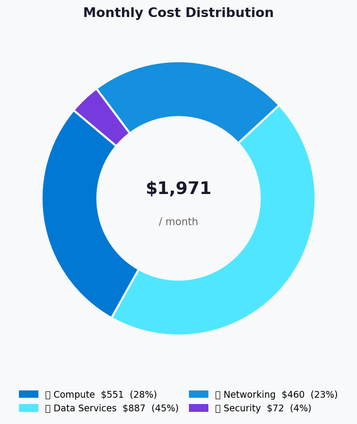
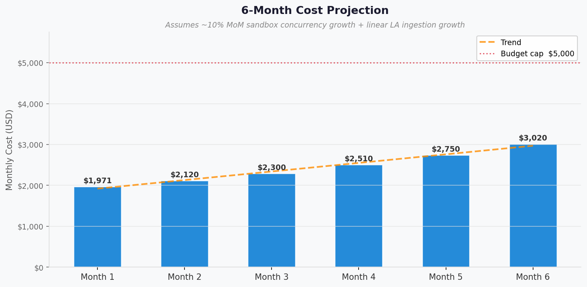

# 💰 Azure Cost Estimate: copilot-agent-execution-platform


<details open>
<summary><strong>📑 Cost Estimate Contents</strong></summary>

- [💵 Cost At-a-Glance](#-cost-at-a-glance)
- [✅ Decision Summary](#-decision-summary)
- [🔁 Requirements → Cost Mapping](#-requirements--cost-mapping)
- [📊 Top 5 Cost Drivers](#-top-5-cost-drivers)
- [🏛️ Architecture Overview](#-architecture-overview)
- [🧾 What We Are Not Paying For (Yet)](#-what-we-are-not-paying-for-yet)
- [⚠️ Cost Risk Indicators](#-cost-risk-indicators)
- [🎯 Quick Decision Matrix](#-quick-decision-matrix)
- [💰 Savings Opportunities](#-savings-opportunities)
- [🧾 Detailed Cost Breakdown](#-detailed-cost-breakdown)
- [References](#references)

</details>

> Generated by architect agent | 2026-05-12

| ⬅️ Previous                                                    | 📑 Index            | Next ➡️                                                      |
| -------------------------------------------------------------- | ------------------- | ------------------------------------------------------------ |
| [02-architecture-assessment.md](02-architecture-assessment.md) | [README](README.md) | [04-governance-constraints.md](04-governance-constraints.md) |

**Generated**: 2026-05-12
**Region**: swedencentral
**Environment**: MVP (Production-shaped, low scale)
**MCP Tools Used**: Azure Pricing MCP `pricing_get` (via cost-estimate-subagent; bulk_estimate not exposed on this MCP surface)
**Architecture Reference**: [02-architecture-assessment.md](02-architecture-assessment.md)

## 💵 Cost At-a-Glance

> **Monthly Total: ~$1,971** | Annual: ~$23,649
>
> ```text
> Budget: $1,000–$5,000/month (soft) | Utilization: ~39% of upper bound ($1,971 of $5,000)
> ```
>
> | Status            | Indicator                                           |
> | ----------------- | --------------------------------------------------- |
> | Cost Trend        | 📈 Growing (sandbox autoscale + LA volume)          |
> | Savings Available | 💰 ~$967/year with 1-yr RI on AKS VM node pools     |
> | Compliance        | ✅ GDPR-aligned (EU residency, ZRS, Defender)        |
> | Revision          | Round 1: Service Bus Standard → Premium (private endpoint requirement; +$665/mo) |

## ✅ Decision Summary

- ✅ Approved: AKS multi-tenant runtime + Container Apps control plane + Front Door Premium + Cosmos serverless + private networking + Defender baseline
- ⏳ Deferred: Multi-region active (cold-restore only); CMK encryption; SOC 2 / ISO 27001; Azure SignalR for live UI stream; Bastion (use Entra PIM JIT instead)
- 🔁 Redesign Trigger: SOC 2 / FedRAMP requirement → CMK + dual-region active; sandbox concurrency >500 sustained → re-evaluate AKS auto-scaling ceiling and Defender vCore scope

**Confidence**: Medium | **Expected Variance**: ±15% (consumption-driven Cosmos RU, LA ingestion, and sandbox autoscale dominate variance). **CMK trigger**: required before SOC 2 readiness, enterprise tier launch, or any tenant requiring customer-controlled encryption.

## 🔁 Requirements → Cost Mapping

| Requirement                              | Architecture Decision                                        | Cost Impact            | Mandatory  |
| ---------------------------------------- | ------------------------------------------------------------ | ---------------------- | ---------- |
| Multi-tenant kernel isolation            | AKS Standard SLA + Pod Sandboxing (Kata) + Spot sandbox pool | +$508/mo (AKS + nodes) | Yes        |
| GDPR EU residency                        | swedencentral region; Storage ZRS                            | Neutral (vs LRS +$1)   | Yes        |
| Sandbox network isolation + egress allowlist | Cilium dataplane + NAT Gateway + 6 Private Endpoints + 6 Private DNS zones | +$90/mo            | Yes        |
| WAF + bot management on public ingress   | Azure Front Door Premium + WAF Premium                       | +$371/mo 📈            | Yes        |
| Defender for Containers / KV / Storage   | Defender Standard plans                                      | +$72/mo                | Yes        |
| Audit log retention ≥ 90 d               | Log Analytics 50 GB/mo + archive to Storage                  | +$115/mo               | Yes        |
| Run state recoverable to RPO 12h         | Cosmos Serverless + PITR                                     | +$24/mo                | Yes        |
| Async run dispatch with sessions + Private Endpoint | Service Bus **Premium** (1 messaging unit) | +$677/mo            | Yes        |

## 📊 Top 5 Cost Drivers

| Rank | Resource                                          | Monthly Cost | % of Total | Trend | Optimization                                       |
| ---- | ------------------------------------------------- | ------------ | ---------- | ----- | -------------------------------------------------- |
| 1️⃣   | Service Bus Premium (1 messaging unit)            | $677.08      | 34.3%      | ➡️    | Required for Private Endpoint support; cannot downgrade. Premium pricing is base-fee only at 1 MU. |
| 2️⃣   | Azure Front Door Premium + WAF + egress           | $371.25      | 18.8%      | ➡️    | Premium is mandatory for private origin — no downgrade. Reduce egress via SPA caching + image compression. |
| 3️⃣   | AKS system node pool (D2as_v5 × 3, on-demand)     | $201.48      | 10.2%      | ➡️    | 1-yr RI saves ~$48/mo (24%); evaluate at 6 mo once stable. |
| 4️⃣   | AKS control-plane node pool (D2as_v5 × 2)         | $134.32      | 6.8%       | ➡️    | 1-yr RI saves ~$32/mo; consolidate with system pool if utilization stays low. |
| 5️⃣   | Log Analytics ingestion (50 GB/mo)                | $115.00      | 5.8%       | 📈    | Daily cap (target 2 GB/day = 60 GB/mo) + table-level archive to Storage; commitment tier at >100 GB/mo. |

> 💡 **Quick Win**: Defer Front Door egress growth by enabling SPA static-asset caching on Front Door rules; saves ~$15–30/mo at scale.

<details>
<summary><strong>Cost Driver Details</strong></summary>

#### 1️⃣ Azure Front Door Premium + WAF + egress

| Aspect            | Detail                                                         |
| ----------------- | -------------------------------------------------------------- |
| Current SKU       | Front Door Premium + WAF Premium policy                        |
| Monthly Cost      | $371.25                                                        |
| Cost Breakdown    | Base fee: $330; Egress (500 GB Zone 1): $41.25; WAF policy: assumed within base |
| Optimization      | Static-asset caching at edge to reduce origin pulls; image compression |
| Potential Savings | $15–30/mo at scale via egress reduction                        |

#### 2️⃣ AKS system node pool (D2as_v5 × 3)

| Aspect            | Detail                                                                            |
| ----------------- | --------------------------------------------------------------------------------- |
| Current SKU       | Standard_D2as_v5 (2 vCPU / 8 GB), 3 nodes on-demand, AZ-spread                    |
| Monthly Cost      | $201.48                                                                           |
| Cost Breakdown    | Compute: $201.48 (PAYG @ $0.092/hr × 3 × 730h)                                    |
| Optimization      | 1-yr Reserved Instance / Savings Plan                                             |
| Potential Savings | $48.35/mo (1-yr RI), $90.67/mo (3-yr RI)                                          |

#### 3️⃣ AKS control-plane node pool (D2as_v5 × 2)

| Aspect            | Detail                                                              |
| ----------------- | ------------------------------------------------------------------- |
| Current SKU       | Standard_D2as_v5, 2 nodes on-demand                                 |
| Monthly Cost      | $134.32                                                             |
| Optimization      | 1-yr RI; or merge into system pool with workload taints if utilization is low |
| Potential Savings | $32.24/mo (1-yr RI), $60.45/mo (3-yr RI)                            |

#### 4️⃣ Log Analytics

| Aspect            | Detail                                                                  |
| ----------------- | ----------------------------------------------------------------------- |
| Current SKU       | PAYG Analytics @ $2.30/GB; 50 GB/mo cap; 30-day retention               |
| Monthly Cost      | $115.00                                                                 |
| Optimization      | Daily cap + archive tables >7 days to Storage; commitment tier at scale |
| Potential Savings | ~25% at 100 GB/mo via 100 GB commitment tier (~$28/mo)                  |

#### 5️⃣ AKS sandbox node pool (D4as_v5 Spot × 4)

| Aspect            | Detail                                                              |
| ----------------- | ------------------------------------------------------------------- |
| Current SKU       | Standard_D4as_v5 Spot (4 vCPU / 16 GB), 4 nodes baseline            |
| Monthly Cost      | $99.29 (~63% off list)                                              |
| Optimization      | Already on Spot. Bound autoscale max-nodes via Azure Policy.        |
| Potential Savings | n/a (already optimal); cost will grow with concurrent sandbox count |

</details>

## 🏛️ Architecture Overview

### Cost Distribution

| Category         | Monthly Cost (USD) | Share  |
| ---------------- | -----------------: | -----: |
| 💻 Compute       |             551.29 |   28.0% |
| 💾 Data Services |             887.24 |   45.0% |
| 🌐 Networking    |             460.40 |   23.4% |
| 🛡️ Security      |              71.92 |    3.6% |



### Month-over-Month Projection



### Key Design Decisions Affecting Cost

| Decision                                  | Cost Impact         | Business Rationale                                                    | Status   |
| ----------------------------------------- | ------------------- | --------------------------------------------------------------------- | -------- |
| AKS Standard SLA tier                     | +$73/mo 📈          | 99.95% SLA on control-plane required for tenant uptime                | Required |
| Front Door Premium (vs Standard)          | +$295/mo 📈         | Private origin support + WAF Premium + bot manager                    | Required |
| Defender for Containers + KV + Storage    | +$72/mo 📈          | Multi-tenant security posture; required for compliance audit trail    | Required |
| 6 × Private Endpoints + Private DNS Zones | +$47/mo 📈          | Network isolation for all data services                               | Required |
| Spot for sandbox node pool                | -$170/mo 📉         | Sandbox runs are checkpointable; ~63% Spot discount                   | Optimal  |
| Cosmos DB Serverless (vs Provisioned)     | -$34/mo 📉 at MVP   | Bursty load; no min-RU floor                                          | Optimal  |
| Storage ZRS (vs GRS)                      | -$8/mo 📉           | EU residency satisfied; ZRS gives zone redundancy at lower cost       | Optimal  |

## 🧾 What We Are Not Paying For (Yet)

- Multi-region active-active deployment (cold restore to `germanywestcentral` only)
- Customer-Managed Keys (CMK) on Storage / Cosmos / KV — platform-managed keys for MVP
- Azure SignalR Service for live UI stream (~$50/mo Standard) — defer until live-stream UX is MVP-critical
- Azure Bastion (~$140/mo) — using Entra PIM + JIT VM access instead
- ACR geo-replication (~$167/mo per replica)
- Azure DDoS Standard ($2,944/mo) — Front Door Premium gives DDoS Protection Basic
- Azure Firewall (~$910/mo) — egress brokered through NAT Gateway + per-pod NetworkPolicy + optional Envoy sidecar
- API Management — control-plane is fronted by Front Door + ACA only at MVP
- Azure OpenAI — agents call GitHub Copilot APIs; no AOAI dependency at MVP
- 24/7 on-call operations cost (best-effort EU business hours only)

### Assumptions & Uncertainty

- Sandbox baseline of 4 Spot nodes assumes 10–40 concurrent sandboxes; will scale linearly above
- Cosmos RU consumption estimated at 50M RU/mo; can swing ±50% based on agent transcript write frequency
- Log Analytics ingestion estimated at 50 GB/mo with daily cap enforcement
- Front Door egress estimated at 500 GB/mo (UI + API responses); will grow with DAU
- Defender for Containers vCore count estimated at 10 (system + control-plane pools); sandbox Spot pool autoscale will increase this
- All prices are PAYG list in USD for `swedencentral`, sourced 2026-05-12 via Azure Pricing MCP

## ⚠️ Cost Risk Indicators

| Resource                          | Risk Level | Issue                                                                         | Mitigation                                                              |
| --------------------------------- | ---------- | ----------------------------------------------------------------------------- | ----------------------------------------------------------------------- |
| AKS sandbox Spot pool             | 🟡 Medium  | Autoscale uncapped → unbounded Spot spend during traffic spike                | Azure Policy: max-nodes ceiling; cluster autoscaler `maxNodeCount` bound |
| Log Analytics                     | 🟡 Medium  | Verbose audit logs + KEDA scaler chatter inflate ingestion → linear $ growth  | 50 GB daily cap; archive verbose tables to Storage; sample HTTP logs    |
| Defender for Containers           | 🟡 Medium  | Per-vCore billing scales with sandbox autoscale → +$7/vCPU/mo                 | Scope Defender plan to specific node pools where supported              |
| Cosmos DB Serverless              | 🟡 Medium  | Per-RU billing on bursty workload — chatty agent transcripts can spike RU     | Batch transcript writes; use change feed for downstream fan-out         |
| Front Door egress                 | 🟢 Low     | Linear with traffic but bounded at MVP DAU                                    | Edge caching for static assets; gzip/brotli on API responses            |

> **⚠️ Watch Item**: Floor cost (~$900/mo at zero traffic: AKS SLA + Front Door Premium + Defender + private networking) is non-discretionary at the security baseline. If MVP traction is slow, this is fixed overhead — communicate to stakeholder pre-build.

## 🎯 Quick Decision Matrix

_"If you need X, expect to pay Y more"_

| Requirement                                       | Additional Cost  | SKU Change                                | Verdict        | Notes                                                            |
| ------------------------------------------------- | ---------------- | ----------------------------------------- | -------------- | ---------------------------------------------------------------- |
| Multi-region active-active                        | +$1,200–1,800/mo | Cosmos multi-region writes + ACA + AKS DR | 🔴 Investigate | Defer until 12-mo SLA target rises above 99.5%                   |
| Customer-Managed Keys (CMK)                       | +$30–50/mo       | KV Premium HSM + CMK config               | 🟡 Monitor     | Defer to pre-SOC 2; minimal cost but operational complexity      |
| Azure SignalR for live UI stream                  | +$50/mo          | Add SignalR Standard tier                 | 🟡 Monitor     | Add when live-stream UX is MVP-critical                          |
| ACR geo-replication                               | +$167/mo         | Add 1 replica region                      | 🔴 Investigate | Single-region MVP doesn't need it; pair with multi-region active |
| 1-yr RI on AKS VM node pools                      | -$80.59/mo       | Reserved Instance commitment              | 🟢 Go (m6+)    | Buy after 6 mo of stable utilization                             |
| 3-yr RI on AKS VM node pools                      | -$151.11/mo      | 3-yr Reserved Instance commitment         | 🟡 Monitor     | Defer until SKU strategy is locked at 12 mo                      |
| Azure DDoS Standard                               | +$2,944/mo       | DDoS Protection Standard plan             | 🔴 Investigate | Front Door Premium covers Basic; only add for explicit threat    |

## 💰 Savings Opportunities

> ### Total Potential Savings: ~$967/year (1-year RI) / ~$1,813/year (3-year RI)
>
> | Strategy                | Commitment | Monthly Savings | Annual Savings | % Reduction |
> | ----------------------- | ---------- | --------------- | -------------- | ----------- |
> | Reserved Instances (RI) | 1-year     | $80.59          | $967.08        | 6.2%        |
> | Reserved Instances (RI) | 3-year     | $151.11         | $1,813.32      | 11.6%       |
> | Spot Instances          | n/a        | already applied | already applied| n/a — sandbox pool already on Spot (~$170/mo saved vs PAYG) |
> | Right-sizing            | n/a        | TBD             | TBD            | Re-evaluate D2as_v5 sizing after 3 mo of utilization data |
> | LA commitment tier      | 100 GB/mo  | ~$28           | ~$336          | ~25% on LA at 100 GB/mo trigger |
> | Front Door edge caching | n/a        | $15–30          | $180–360       | 4–8% on Front Door egress at scale |

## 🧾 Detailed Cost Breakdown

### Assumptions

- Hours: 730/month
- Network egress (Front Door): 500 GB/mo at MVP DAU
- NAT Gateway egress: 200 GB/mo
- Cosmos RU consumption: ~50M RU/mo
- Log Analytics ingestion: 50 GB/mo (capped)
- Storage capacity: 100 GB hot + 50 GB cool; 20M transactions/mo
- Key Vault operations: ~5M/mo
- All prices: USD, PAYG list, `swedencentral`, sourced 2026-05-12

### Line Items

| Category         | Service                                  | SKU / Meter                              | Quantity / Units                           | Est. Monthly |
| ---------------- | ---------------------------------------- | ---------------------------------------- | ------------------------------------------ | ------------ |
| 💻 Compute       | AKS Cluster                              | Standard Uptime SLA                      | 1 cluster × 730 h                          | $73.00       |
| 💻 Compute       | AKS system node pool                     | Standard_D2as_v5                         | 3 × 730 h                                  | $201.48      |
| 💻 Compute       | AKS control-plane node pool              | Standard_D2as_v5                         | 2 × 730 h                                  | $134.32      |
| 💻 Compute       | AKS sandbox node pool                    | Standard_D4as_v5 Spot                    | 4 × 730 h                                  | $99.29       |
| 💻 Compute       | Container Apps                           | Standard Consumption (vCPU + GiB-sec)    | 400 vCPU-h + 800 GiB-h                     | $43.20       |
| 💾 Data Services | Container Registry                       | Premium                                  | 1 registry × 730 h                         | $50.69       |
| 💾 Data Services | Service Bus                              | Premium (1 messaging unit, base hourly)  | 1 MU × 730 h                               | $677.08      |
| 💾 Data Services | Cosmos DB (NoSQL)                        | Serverless RU + Storage + PITR           | 50M RU + 20 GB + 20 GB PITR                | $24.25       |
| 💾 Data Services | Storage Account                          | Standard ZRS Hot/Cool + ops              | 150 GB + 20M tx                            | $5.22         |
| 💾 Data Services | Key Vault                                | Standard ops                             | 5M operations                              | $15.00       |
| 💾 Data Services | Log Analytics                            | PAYG Analytics                           | 50 GB ingestion                            | $115.00      |
| 🌐 Networking    | Azure Front Door + WAF                   | Premium base + Egress (Zone 1)           | 1 profile + 500 GB                         | $371.25      |
| 🌐 Networking    | Private Endpoints                        | Standard PE-hours + data processed       | 6 × 730 h + 50 GB                          | $44.30       |
| 🌐 Networking    | Private DNS Zones                        | per zone-month                           | 6 zones                                    | $3.00        |
| 🌐 Networking    | NAT Gateway                              | Standard hourly + processed              | 1 × 730 h + 200 GB                         | $41.85       |
| 🌐 Networking    | Virtual Network                          | Base                                     | 1 VNet                                     | $0.00        |
| 🛡️ Security      | Defender for Containers                  | Standard vCore                           | 10 vCPU × 730 h                            | $68.69       |
| 🛡️ Security      | Defender for Key Vault                   | Per-node Std                             | 1 vault                                    | $0.25        |
| 🛡️ Security      | Defender for Storage                     | Standard (per-tx)                        | 20M tx                                     | $2.98        |
| **Total**        |                                          |                                          |                                            | **$1,970.86** |

### Notes

- **Tooling note**: `azure_bulk_estimate` and `azure_price_search` were not exposed by this MCP endpoint surface; the cost-estimate-subagent fell back to per-line `pricing_get` calls (34 MCP calls total).
- **Front Door WAF**: a standalone WAF policy meter was not returned by `pricing_get` at query time; estimate assumes WAF cost is bundled in the Premium base fee. Verify against actual invoice in month 1.
- **RI eligibility**: 1-year and 3-year savings quantified for VM-backed AKS node pools (Standard_D2as_v5). Sandbox Spot pool is not RI-eligible.
- **Dev/Test pricing**: Not applied — MVP runs production-shaped workload; revisit if a separate Dev environment is provisioned.
- **Cost growth driver**: Sandbox autoscale + Defender vCore scope are the two consumption-coupled lines; both are bounded by Azure Policy ceiling defined in Step 4.

---

## References

| Topic                    | Link                                                                                                                   |
| ------------------------ | ---------------------------------------------------------------------------------------------------------------------- |
| Azure Pricing Calculator | [Calculator](https://azure.microsoft.com/pricing/calculator/)                                                          |
| Cost Management          | [Overview](https://learn.microsoft.com/azure/cost-management-billing/costs/overview-cost-management)                   |
| Reserved Instances       | [Reservations](https://learn.microsoft.com/azure/cost-management-billing/reservations/save-compute-costs-reservations) |
| WAF Cost Optimization    | [Checklist](https://learn.microsoft.com/azure/well-architected/cost-optimization/checklist)                            |
| AKS Spot Node Pools      | [AKS Spot](https://learn.microsoft.com/azure/aks/spot-node-pool)                                                       |
| Cosmos Serverless        | [Serverless Pricing](https://learn.microsoft.com/azure/cosmos-db/serverless)                                           |
| Front Door Premium SKU   | [Front Door Pricing](https://azure.microsoft.com/pricing/details/frontdoor/)                                           |

---

<div align="center">

| ⬅️ [02-architecture-assessment.md](02-architecture-assessment.md) | 🏠 [Project Index](README.md) | ➡️ [04-governance-constraints.md](04-governance-constraints.md) |
| ----------------------------------------------------------------- | ----------------------------- | --------------------------------------------------------------- |

</div>
